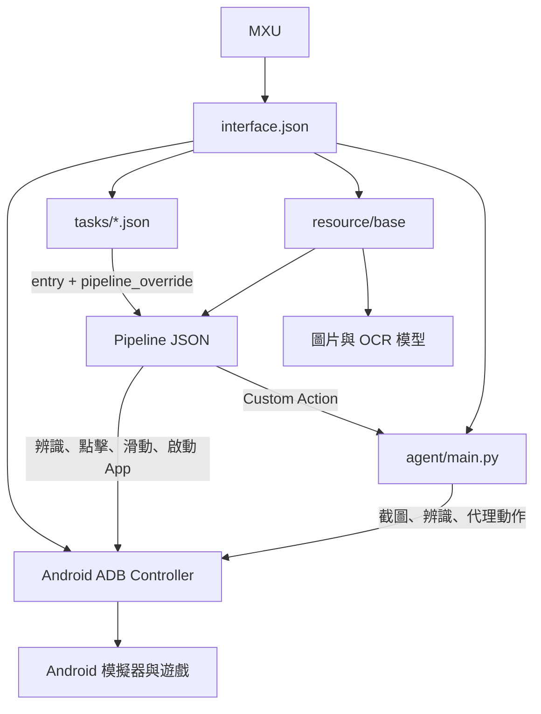

# 專案架構

MaaSwordStaff 是資料驅動的 MaaFramework 專案。MXU 負責介面與執行協調，Pipeline 負責辨識／操作流程，Python Agent 只補上 Pipeline 無法表達的計數與狀態邏輯。

## 執行入口

`interface.json` 是唯一的專案入口，現在宣告：

- 一個 `Android` ADB controller，`display_short_side` 為 720。
- 一個 `base` 台服 resource，路徑為 `resource/base`。
- 一個由 `python -u ./agent/main.py` 啟動的 Agent 子行程。
- `Home`、`Guild`、`Note`、`Map`、`Other` 五個介面群組。
- 4 份公開任務定義與 3 份 preset 定義，共 23 個公開任務。

只有 `interface.json#import` 列出的 task／preset 檔會出現在 MXU。檔案存在不代表已載入；目前 `tasks/startup.json` 就是刻意未匯入的例子。

## 各層責任

| 層         | 位置                                               | 責任                                                    | 不負責                                   |
| ---------- | -------------------------------------------------- | ------------------------------------------------------- | ---------------------------------------- |
| 專案介面   | `interface.json`                                   | 版本、controller、resource、Agent、群組與 imports       | 遊戲畫面判斷                             |
| 任務介面   | `tasks/*.json`                                     | 名稱、說明、entry、選項與 `pipeline_override`           | 真正點擊與辨識                           |
| Preset     | `tasks/preset/*.json`                              | 一鍵加入哪些任務、順序與預設覆寫                        | 串成單一 Pipeline；每個 task 仍獨立提交  |
| Pipeline   | `resource/base/pipeline/*.json`                    | recognition、action、`next`、`on_error`、重試與停止條件 | 複雜算術與跨次執行的任意狀態保存         |
| 辨識資源   | `resource/base/image/`、`resource/base/model/ocr/` | TemplateMatch 圖片與 OCR 模型                           | UI 任務定義                              |
| Agent      | `agent/main.py`                                    | 計數、限購、組隊與狀態彙整等 Custom Action              | 取代整套 Pipeline 導航                   |
| Controller | MaaFramework ADB controller                        | 連線、截圖、輸入、啟動 App、座標縮放                    | 判斷任務是否在遊戲內成功                 |
| 離線回歸   | `maatools.config.mts`、`tests/screenshots/`        | 描述哪張截圖應命中哪些節點；目前未接線且已過期          | 任何自動保障——沒有 script 或 CI 會執行它 |

## 任務到 Pipeline 的資料流

1. MXU 讀取 `interface.json`，載入 resource 與被 import 的 task 定義。
2. 使用者選擇任務與選項；MXU 將選項轉成對 Pipeline 的暫時覆寫。
3. 任務的 `entry` 指向一個 Pipeline root，例如 `DailyDungeon` 指到 `Objectives.Daily.Dungeon1.Start`。
4. MaaFramework 依節點的 recognition 判斷目前畫面，成功後執行 action，再按順序嘗試 `next` 候選。
5. 遇到 `action: "Custom"` 時，交給 Agent 的同名 Custom Action；Agent 經由 Context 使用截圖、辨識與代理點擊。
6. 任務完成只代表執行鏈結束。若要宣稱遊戲成功，還要看到結果畫面、計數變化、按鈕狀態或資源變化。

`pipeline_override` 是載入後的暫時 JSON overlay，不是資料夾、資料庫或對來源檔的修改。使用者選項由 MXU 自己保存；OCR 文字、位置與信心值則是單次執行資料，不會自動寫回選項。

## Pipeline 拆分

| Pipeline                                  | 主要用途                                          |
| ----------------------------------------- | ------------------------------------------------- |
| `navigation.json`、`note.json`            | 共用底部導航、根畫面復原與筆記入口                |
| `home_rewards.json`                       | 家園床與推車收益                                  |
| `home_facilities.json`                    | 家園商店、道具、煉金、祈願、扭蛋、結緣與 NPC 禮物 |
| `guild_facilities.json`                   | 公會放置、捐贈、討伐、商店與冶煉工坊              |
| `daily_dungeon.json`、`arena.json`        | 日常副本與競技場                                  |
| `beast_trial.json`、`phantom_realm.json`  | 組隊戰鬥流程                                      |
| `bond_adventure.json`、`map_explore.json` | 奇景委派與地圖探索領取                            |
| `material_realm.json`                     | 四種素材秘境                                      |
| `commissions.json`                        | 委託任務                                          |
| `reward_claims.json`                      | 統一領獎與各領獎內部流程                          |
| `objective_catalog.json`                  | 探尋命運、消耗體力與未公開的活動目標骨架          |
| `startup.json`                            | 啟動／公告／登入辨識；目前沒有公開 task import    |

`resource/base/default_pipeline.json` 放全域 Pipeline 預設值。增加欄位前先查 `tools/schema/pipeline.schema.json`，不要只依印象猜 MaaFramework 語意。

## Agent 邊界

`agent/main.py` 目前註冊 5 個 Custom Action：

| Action                  | 用途                                                 |
| ----------------------- | ---------------------------------------------------- |
| `PullByCount`           | 祈願、扭蛋、結緣與公會捐贈的目標次數／已完成次數計算 |
| `RenewFurnace`          | 讀取公會熔爐剩餘天數並補到目標                       |
| `BuyLimitedCount`       | 日常副本、競技券與素材秘境等限購次數計算             |
| `FillPartyWithPartners` | 讀取隊伍人數並用 AI 夥伴補滿                         |
| `BondScenicReport`      | 彙整奇景委派的可領、空位、進行中與完成狀態           |

Agent 使用 `maafw==5.12.3`。Pipeline 呼叫名稱、Agent decorator 與參數格式必須一起修改；只改其中一端會在執行時失敗。

## 發行架構

`maa-project.json` 目前只啟用 MXU。`tools/build-custom-mxu.mjs` 會固定抓取 MXU `v2.4.5` 的指定 commit、套用 `patches/mxu/github-only-v2.4.5.patch`，建置後寫入來源標記。`tools/build-release.mjs` 會拒絕沒有正確標記的 GitHub-only MXU runtime，再組裝專案、Agent 與內嵌 Python。

完整版本與 asset 規則見 [發布流程](./release.md)。
